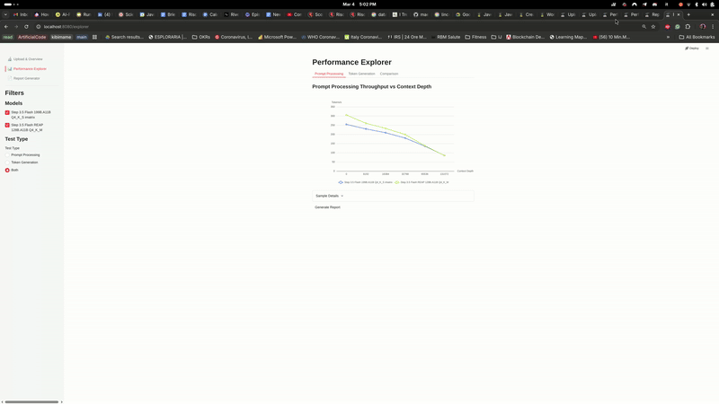

# llama-bench Analyzer

A web app to upload, explore, and report on [llama-bench](https://github.com/ggml-org/llama.cpp) benchmark results. Built with [Javelit](https://javelit.io/) — runs as a single Java file with zero setup.



## Features

- **Upload** one or more llama-bench JSON files
- **Interactive charts** for prompt processing and token generation throughput vs. context depth
- **Side-by-side comparison** of multiple models and quantizations
- **PDF report** generation with configurable sections

## Pages

| Page | Description |
|------|-------------|
| Upload & Overview | Upload JSON files, view summary stats, inspect raw data |
| Performance Explorer | Interactive ECharts line/bar charts with model & test-type filters |
| Report Generator | Configure and generate a downloadable PDF report |

## Requirements

- Java 21+

## Quick Start

```bash
./run.sh
```

This will download Javelit if needed and start the app. Open the printed URL in your browser.

Alternatively, if you have the [Javelit CLI](https://javelit.io/) installed:

```bash
javelit run App.java
```

## Tech Stack

- **Javelit 0.86.0** — UI framework
- **ECharts (via echarts-java)** — interactive charts
- **Gson** — JSON parsing
- **Apache PDFBox 3.0** — PDF generation

## License

[Apache License 2.0](LICENSE)
